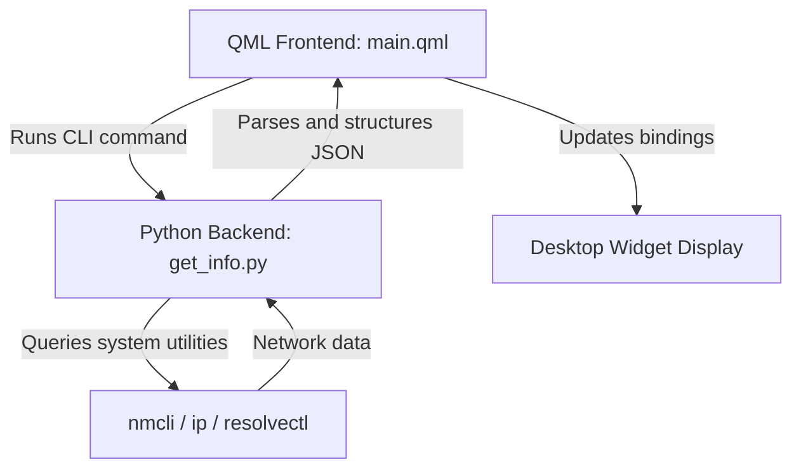

# Development Guide: Network Info Widget

This guide provides technical information about the architecture of the **Network Info Widget**, how to run and test it locally, and how to prepare a release package.

---

## 📂 Architecture Overview

The widget uses a decoupled frontend-backend architecture:

1. **Frontend (QML)**: Located in `contents/ui/main.qml`, it renders the native KDE Plasma interface using QML and the `org.kde.kirigami` and `org.kde.plasma.components` frameworks.
2. **Backend (Python)**: Located in `contents/ui/get_info.py`, it executes standard Linux utilities (`nmcli`, `resolvectl`, `ip`) to retrieve active connection interfaces, SSIDs, IP addresses, gateways, and DNS details.



### Communication Flow
* The QML frontend uses KDE's `Plasma5Support.DataSource` (with the `executable` engine) to run the backend script asynchronously.
* The script is executed as:
  ```bash
  python3 contents/ui/get_info.py --json [--show-ipv6 | --hide-ipv6]
  ```
* The stdout from the Python script is captured, parsed as JSON in JavaScript, and bound to reactive QML properties (`root.localIp`, `root.dnsInfo`, etc.).

---

## 🛠️ Development Workflow

To make modifications and see them live:

1. **Clone the repository** to your development directory:
   ```bash
   git clone https://github.com/KnowOneActual/org.fedora.networkwidget.git ~/github/org.fedora.networkwidget
   ```
2. **Create a symbolic link** in the Plasma local plasmoids directory:
   ```bash
   ln -s ~/github/org.fedora.networkwidget ~/.local/share/plasma/plasmoids/org.fedora.networkwidget
   ```
3. **Restart the plasmashell** to load the new widget:
   ```bash
   systemctl --user restart plasma-plasmashell
   ```

---

## 🧪 Testing & Debugging

### 1. Testing the Python Backend
You can run the backend script directly in your terminal to verify interface detection and JSON outputs:

```bash
# Test pretty-printed terminal table output (default)
python3 contents/ui/get_info.py

# Test structured JSON output (used by QML)
python3 contents/ui/get_info.py --json

# Test with IPv6 hidden
python3 contents/ui/get_info.py --json --hide-ipv6
```

### 2. Testing the QML Frontend Standalone
Instead of restarting your whole desktop shell after every QML edit, you can load the widget in KDE's standalone development container:

```bash
# Open using plasmoidviewer
plasmoidviewer -a org.fedora.networkwidget
```
*(This loads the widget in a standalone window, allowing you to test interactions like toggles, hover states, and click-to-copy).*

### 3. Inspecting Logs
To view QML warnings, `console.log()` outputs, or Python runtime tracebacks, inspect the systemd user journal:

```bash
journalctl --user -f -u plasma-plasmashell
```

---

## 📦 Packaging for Release

To build the final `.plasmoid` package for distribution:

1. Ensure you are in the root directory of the project.
2. Run the `zip` command containing only the necessary runtime files (excluding `.git`, docs, and backup packages):
   ```bash
   zip -r org.fedora.networkwidget.plasmoid metadata.json contents/ preview.webp
   ```
3. Test installing the newly generated package:
   ```bash
   # Remove existing
   kpackagetool6 --type Plasma/Applet --remove org.fedora.networkwidget
   # Install new
   kpackagetool6 --type Plasma/Applet --install org.fedora.networkwidget.plasmoid
   ```
