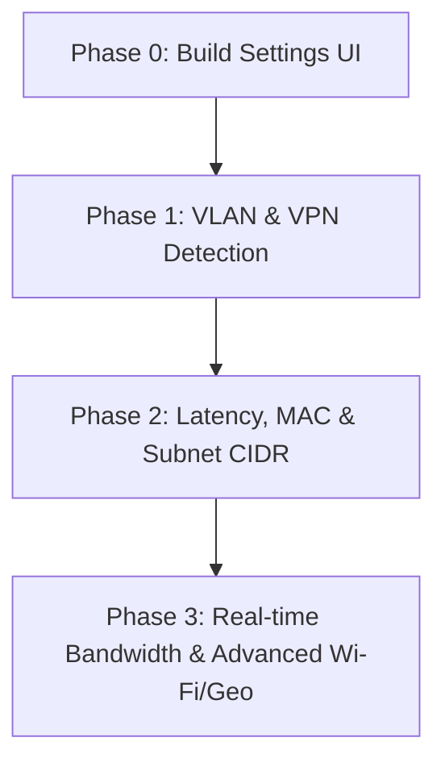

# Roadmap: Advanced Network Info Widget Features

This document outlines the roadmap for implementing all requested network features. To maintain the widget's minimal and clean default appearance, these features will be **opt-in** via advanced configuration settings.

---

## 1. Advanced Configuration Architecture

To keep the default widget clean, we will implement a configuration interface that allows users to toggle each feature independently.

### QML Configuration UI Layout
We will introduce a standard settings page in the Plasmoid using KDE's native configuration system:
* **[NEW] `contents/config/config.qml`**: Registers the configuration category.
* **[NEW] `contents/ui/configGeneral.qml`**: Renders the settings checkboxes (using `Kirigami.FormLayout`).
* **`contents/config/main.xml`**: Defines the setting entries and defaults (all defaulting to `false`).

```xml
<!-- Proposed additions to main.xml -->
<entry name="showVlan" type="Bool"><default>false</default></entry>
<entry name="showVpn" type="Bool"><default>false</default></entry>
<entry name="showLatency" type="Bool"><default>false</default></entry>
<entry name="showBandwidth" type="Bool"><default>false</default></entry>
<entry name="showMacAddress" type="Bool"><default>false</default></entry>
<entry name="showExtendedWifi" type="Bool"><default>false</default></entry>
<entry name="showGeo" type="Bool"><default>false</default></entry>
```

---

## 2. Feature Breakdown & Implementation Details

### Phase 1: VLAN Detection (Ethernet / Virtual Interfaces)
* **Goal**: Detect if the current interface is a Virtual LAN (VLAN), extract its VLAN ID, parent interface, and display it.
* **Logic (`get_info.py`)**:
  1. Check if the active interface is a VLAN by reading `/sys/class/net/<interface>/uevent` and looking for `DEVTYPE=vlan`.
  2. If it is a VLAN, query `ip -d link show <interface>` or parse NetworkManager connections to find the VLAN ID.
  3. Extract the parent interface name by listing `/sys/class/net/<interface>/` for any directories matching `lower_*`.
* **QML Display**:
  * If `showVlan` is active and a VLAN is detected, display `VLAN ID: <ID> (Parent: <Interface>)`.

### Phase 2: VPN Connection Status
* **Goal**: Show if traffic is routing through a VPN (OpenVPN, WireGuard, etc.) and list the active VPN profile name.
* **Logic (`get_info.py`)**:
  * Execute `nmcli -t -f name,type,active connection show` and search for active connections where `type` is `vpn` or `wireguard`.
* **QML Display**:
  * Display `VPN: Active (<VPN Connection Name>)` or `VPN: Disconnected`.

### Phase 3: Connection Latency / Ping
* **Goal**: Show RTT latency to check network quality.
* **Logic (`get_info.py`)**:
  * Execute `ping -c 1 -W 1 1.1.1.1` (or target the default gateway) and parse the round-trip average time (e.g. `24 ms`).
* **QML Display**:
  * Display `Network Latency: 24 ms`.

### Phase 4: Subnet CIDR & MAC Address
* **Goal**: Expose hardware address and subnet details.
* **Logic (`get_info.py`)**:
  * Read the MAC address from `/sys/class/net/<interface>/address`.
  * Retrieve the CIDR subnet mask (e.g., `/24`) directly from the local IP retrieval command.
* **QML Display**:
  * Display local IP as `192.168.1.15/24`.
  * Display `MAC Address: XX:XX:XX:XX:XX:XX`.

### Phase 5: Real-time Bandwidth (Speed & Usage)
* **Goal**: Calculate real-time rx/tx speed and total downloaded/uploaded data in the current session.
* **Logic (`get_info.py`)**:
  * Read bytes from `/sys/class/net/<interface>/statistics/rx_bytes` and `tx_bytes`.
  * Calculate download/upload speed by computing the difference between consecutive checks divided by the time interval (60 seconds by default, or shorter if refresh is triggered).
* **QML Display**:
  * Display `Speed: Rx: 1.2 MB/s, Tx: 140 KB/s`.
  * Display `Total Data: Down: 520 MB, Up: 45 MB`.

### Phase 6: Extended Wi-Fi & ISP/Geo Details
* **Goal**: Show detailed Wi-Fi channel/band/security details and public network ISP/location.
* **Logic (`get_info.py`)**:
  * For Wi-Fi: Fetch SSID security type and frequency from `nmcli -t -f active,ssid,chan,freq,rate,signal,security dev wifi`.
  * For ISP/Geo: Fetch geolocation metadata (ISP name, city, country) from a public API like `ip-api.com/json` (with a short 1.5s timeout).
* **QML Display**:
  * Display Wi-Fi as: `SSID: MyNetwork (5 GHz, Ch 149, WPA3, 866 Mbps)`.
  * Display ISP/Location as: `ISP: Comcast (Chicago, US)`.

---

## 3. Recommended Phased Rollout Plan



1. **Phase 0**: Add configuration options to [main.xml](file:///home/user/github/org.fedora.networkwidget/contents/config/main.xml) and design the settings panel in `config.qml` / `configGeneral.qml` to toggle settings.
2. **Phase 1**: Implement VLAN detection and active VPN parsing in [get_info.py](file:///home/user/github/org.fedora.networkwidget/contents/ui/get_info.py) and render them in [main.qml](file:///home/user/github/org.fedora.networkwidget/contents/ui/main.qml).
3. **Phase 2**: Add MAC address, CIDR prefix parsing, and network latency check.
4. **Phase 3**: Add real-time statistics (rx/tx bandwidth speeds) and geo lookup.
